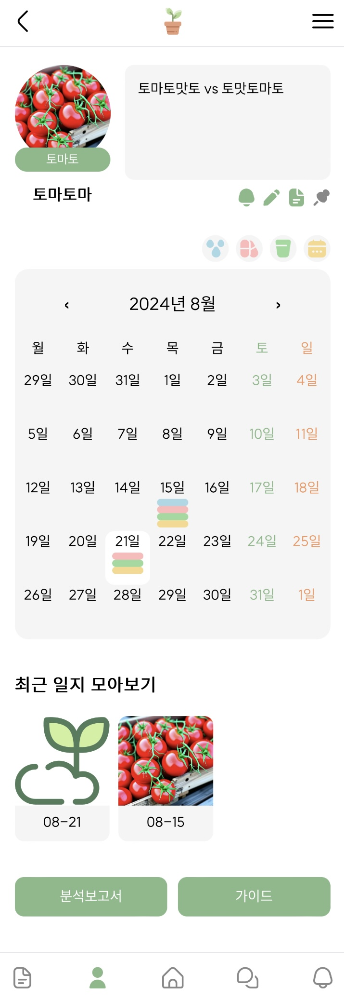

# 삼성 청년 SW 아카데미 (SSAFY) 11기 - 2학기 공통프로젝트
## Plog

## 1. 서비스 소개
### 개요
* Plog(Plant + Log)
* 식물을 키우는 사람들을 위한 SNS 서비스
* 식물 관리 기능과 SNS 기능을 결합하여 식물 애호가들이 자신의 식물 성장 과정을 기록하고 공유할 수 있도록 돕는 모바일 웹앱

### 타겟
* 30 - 40 대 주부
* 식물 키우기에 대한 정보가 필요한 초보 식집사

## 2. 기획 배경

최근 집에서 식물을 키우는 사람들이 증가하면서, 식물 관련 정보를 교환하고 자신의 식물 키우기 경험을 공유할 수 있는 플랫폼에 대한 필요성이 커지고 있습니다.

특히, 30-40대 주부들 사이에서 식물 가꾸기가 힐링의 방법으로 인기를 끌고 있지만, 초보 식집사들은 적절한 정보를 얻기 어려워하는 경우가 많습니다.

 
 

이러한 배경으로 초보 식집사들이 서로 정보를 나누고 경험을 기록하며, 식물 키우기에 대한 자신감을 얻을 수 있는 SNS 플랫폼을 기획하게 되었습니다.

## 3. 주요 기능
1. **식물 일지**: 사용자가 자신의 식물 키우기 과정을 기록할 수 있는 일지 기능을 제공합니다. 사진과 텍스트, 관리 현황(물주기, 영양제, 분갈이, 날씨 등)을 날짜별로 기록할 수 있습니다. 캘린더를 활용해 월별 관리 현황을 한 눈에 알 수 있도록, 사용자에게 편안한 UX를 제공합니다.
2. **식물 가이드**: 다양한 식물에 대한 정보를 제공하여, 초보 식집사들이 각 식물을 키우는 데에 필요한 정보를 쉽게 찾을 수 있습니다.
3. **알림 기능**: 각 식물 종에 따른 적절한 관리 일정을 알림을 통해 알려줍니다.
4. **식물 관리 분석**: 사용자가 기록한 일지를 기반으로, 식물 관리 상태를 분석하고 그를 SNS에 공유하는 기능을 제공합니다.
5. **커뮤니티 기능**: 식집사들이 서로 소통할 수 있는 커뮤니티 기능을 제공합니다. 이웃 기능과 이웃 공개 SNS 기능을 통해 사용자들 간의 유대감을 높일 수 있도록 돕습니다. 채팅 기능을 통해 활발한 커뮤니티 활동을 지원합니다. 또한, 좋아요 기능을 통해 사용자에게 인기글을 추천해줄 수 있으며, 북마크 기능을 통해 원하는 게시글은 나중에도 볼 수 있도록 합니다.

## 4. 기술
1. **프론트엔드**: Figma를 활용해 와이어프레임을 설계하며, SNS 서비스에 적합한 컴포넌트 단위로 디자인해 재사용성을 높였습니다. React와 PWA를 사용해 개발하였으며, 다양한 모바일 기기에서 일관성 있는 UX/UI를 제공합니다. 데이터 업데이트 시 API를 기반으로 최소한의 정보만 리렌더되도록 설계하여 성능 최적화를 고려했습니다.
2. **백엔드**: Spring Boot를 사용하여 서버를 구축하였으며, 데이터베이스는 MySQL와 JPA를 사용하여 안정적인 데이터 관리 및 구현을 했습니다.
3. **데브옵스**: AWS의 EC2 서버를 활용하여 Docker를 바탕으로 서비스의 배포와 관리를 진행하였으며, jenkins를 활용하여 CI/CD 파이프라인을 구축하여 자동화된 배포 환경을 구현했습니다.

## 5. 협업 툴 및 협업 환경
1. **협업 툴**: 
   - **Gitlab**: 코드 버전 관리를 위해 사용하였으며, 브랜치 전략을 통해 효율적인 협업을 진행했습니다.
   - **JIRA**: 프로젝트 관리 및 스프린트 계획을 위해 사용하였으며, 각 팀원의 작업 현황을 실시간으로 확인할 수 있도록 했습니다.
   - **Notion**: 문서화 작업과 회의록 작성, 아이디어 정리를 위해 사용했습니다.
   - **Figma**: UX/UI 디자인 협업 툴로 사용되었으며, 프론트엔드 개발 과정에서 와이어프레임 설계, 컴포넌트 단위 디자인, 프로토타입 제작 및 디자인 피드백을 공유하는 데 활용했습니다.

2. **협업 환경**: 
   - **코드 리뷰**: GitLab의 Pull Request 기능을 통해 코드 리뷰를 진행하여 코드 품질을 높이고, 팀원 간의 지식을 공유하는 문화를 조성했습니다.
   - **애자일 개발**: 스크럼 방법론을 도입하여 짧은 스프린트를 통해 빠르게 피드백을 반영하고, 개발 속도를 최적화했습니다.
   - **정기 회의**: 매일 오전 스탠드업 미팅을 통해 진행 상황을 공유하고, 장애 요소를 조기에 발견하여 해결할 수 있도록 했습니다.

## 6. 역할 분담
|오예진|진아영|차유림|이영원|강윤서|장현준|
|---|---|---|---|---|---|
|팀장, FE리더|FE|FE|Infra, BE리더|BE|BE|

## 7. 프로젝트 결과물
* **PWA 웹 애플리케이션**
   * 식물 키우기를 위한 SNS 서비스 "Plog"의 최종 완성본
* **기술 문서**
   * 시스템 아키텍처, API 문서, 기술 명세서, JIRA 관리 기록 등
* **서비스 화면**
   1. 홈화면
        
   2. 비회원 화면
       
      
       
   3. 프로필
       
      
      
      
      
       
   4. 식물 디테일
       
      
      
      
      
      
      
      
      
      
       
   5. 채팅
       
       
   6. 알림창
        

## 8. 서비스 데모 영상
<iframe width="866" height="487" src="https://www.youtube.com/embed/PJzseIhlXmQ" title="Plog" frameborder="0" allow="accelerometer; autoplay; clipboard-write; encrypted-media; gyroscope; picture-in-picture; web-share" referrerpolicy="strict-origin-when-cross-origin" allowfullscreen></iframe>

## 9. 개발 일정
1. **1주차**: 기획 및 요구사항 분석, 역할 분담
2. **2주차**: UX/UI 디자인 및 데이터베이스 설계
3. **3-4주차**: 프론트엔드 및 백엔드 기본 기능 개발
4. **5주차**: API 연동
5. **6주차**: 기능 통합 및 최종 테스트
6. **7주차**: 버그 수정 및 최종 발표 준비
